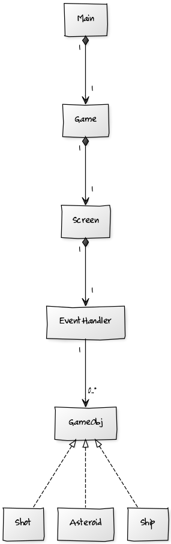

## Projektin aihe

**Aihe:** Asteroids on klassinen peli, jossa pelaaja ohjaa avaruusalusta ampuen asteroideja ja välttäen törmäystä niihin.

**Käyttäjät:** Pelaaja

**Toiminnot kaikille:** 
* Käynnistää peli
* Kääntää alusta vasemmalle ja oikealle
* Kiihdyttä alusta nokan osoittamaan suuntaan
* Ampua aluksella
* Alus tuhoutuu osutessa asteroidiin
* Pistelaskuriin kertyy pisteitä, kun ammuttu ammus tuhoaa asteroideja

**Ohjeet:**

| Painike          | Toiminto                |
|:----------------:|:----------------------- |
| Nuoli vasemmalle | Alus kääntyy vasemmalle |
| Nuoli oikealle   | Alus kääntyy oikealle   |
| Välilyönti       | Alus ampuu              |
| P                | Peli tauolle            |
| Esc              | Toistuu pelistä         |

### [Rakennekuvaus](Rakennekuvaus.md)

### Luokkakaavio

### Sekvenssiokaaviot

#### Alus kääntyy

#### Alus ampuu
